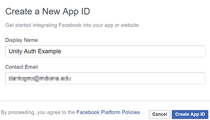

# Facebook authentication with Unity and Azure

## Overview

This project demonstrates how to incorporate Facebook authentication to a Unity project that stores high score and game telemetry data in Azure Easy Tables.

The approach uses UnityWebRequest to send HTTP requests to an Azure function app that handles authentication and data insertion and retrieval.

### Compatibility

This approach should work for any Unity platform supported by the Facebook SDK.
* iOS
* Android
* WebGL

> [!NOTE]
> PC builds can be supported by using the Facebook Gameroom build feature of Unity.

### Prerequisites

* Unity 2017 (personal version is fine)
* Azure subscription
* Visual Studio 2017 (Community edition is fine) with Game Development with Unity workload
* Facebook account

## Facebook setup

Go to [developers.facebook.com](https://developers.facebook.com) and log in. If you haven't before, upgrade your account to a developer account.

* Click **My Apps** > **Add a New App**.

* Enter a name and contact info for the new app.

